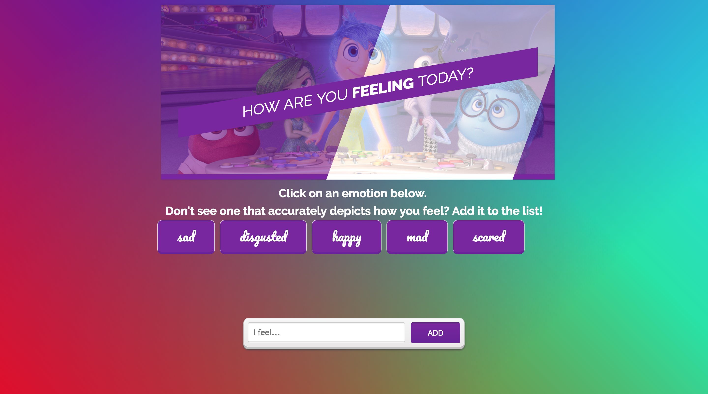

## GIPHY Emotions - How are you feeling?
A webapp using the GIPHY API to display 10 gifs according to certain topics. This is a class assignment to practice using APIs.

## Demo
Here is a working live demo: https://icarolyn.github.io/GIPHY
 
## Screenshots

## Tech/framework used

<b>Built with</b>
- [jQuery - AJAX](https://jquery.com)
- [GIPHY API] (https://developers.giphy.com)

## License

Northwestern University © [Carolyn Rojsutivat]()